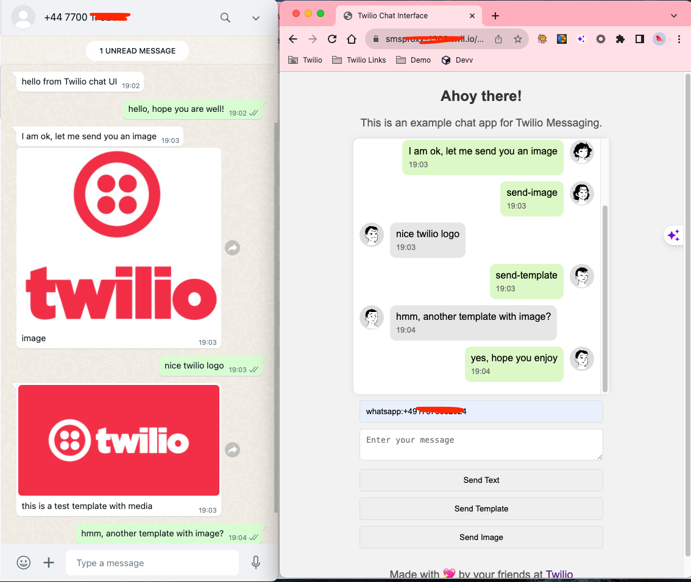
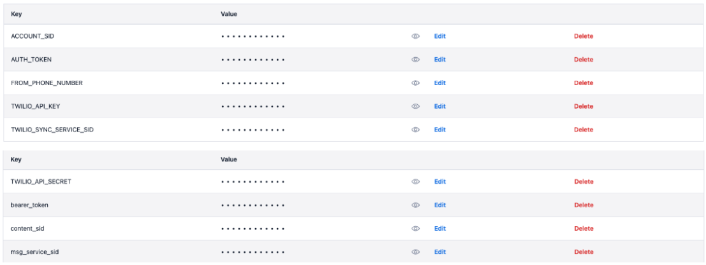

# Twilio-Messaging-UI
This project demonstrates the power and versatility of Twilio's APIs and serverless architecture in creating a dynamic and responsive chat application.

screenshot-ui.png
 

About the Project:

This repository contains the complete source code for building a real-time chat interface using Twilio. The project leverages Twilio Sync for real-time state synchronization, Programmable SMS for message handling, and Twilio Functions for serverless backend logic. It's designed as an interactive and user-friendly chat application capable of handling SMS and WhatsApp messages, including special features for sending images and templates.

Key Features:

- Real-time messaging with Twilio Sync.
- Support for both SMS and WhatsApp messaging.
- Backend processing with Twilio Functions, including sending messages, token generation, and handling incoming messages.
- Frontend design with responsive HTML/CSS and interactive JavaScript.
- Advanced chat features like image URL display, message timestamps, and WhatsApp-specific functionalities.

## **Setting Up the Project**

Creating a real-time chat interface with Twilio involves several setup steps. In this section, we’ll guide you through the initial setup process, including Twilio Sync and Twilio Functions, to lay the groundwork for our chat application.

- **Prerequisites**: Before diving in, ensure you have a Twilio account. If you don't have one yet, you can sign up at the Twilio website.
- **Setting Up a Twilio Account**:
    - Log into your Twilio account and create a new messaging service.
    - Navigate to the console dashboard where you can find your Account SID and Auth Token. These are crucial for authenticating your application with Twilio's services.
    - Procure a Twilio phone number and also add it as a Whatsapp sender.
    - Add both the Twilio number and WhatsApp sender into the sender pool of the messaging service created before.
- **Setting Up Twilio Sync**:
    - In your Twilio Console, find and enable Twilio Sync services. This might involve creating a Sync Service instance, which gives you a unique Service SID.
    - Create an [API Key and API Secret](https://www.twilio.com/docs/iam/api-keys/api-key) for generating Sync [Access Token](https://www.twilio.com/docs/iam/access-tokens).
- **Setting Up Twilio Functions**:
    - Twilio Functions will serve as the backend for our chat application. These serverless functions are executed in Twilio’s environment and remove the need for your own server infrastructure.
    - Make sure to configure the functions with the necessary environment variables (like your Account SID and Auth Token) and dependencies. Please check screenshot below for this project.
        
        
        

With these steps, your project is now set up with both a real-time synchronization service and a serverless backend environment. This setup forms the foundation for building the interactive features of your chat application.
